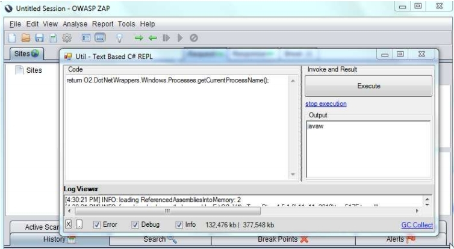
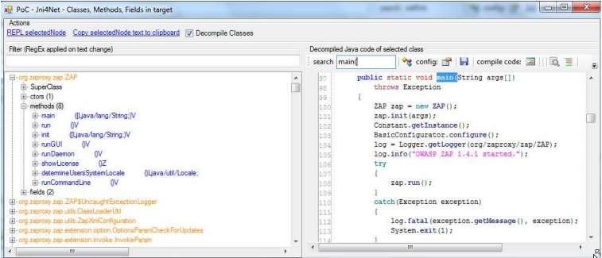

##  C# REPL a java process (ZAP Proxy)

After I discovered the [Jni4Net ](http://jni4net.sourceforge.net/) FOSS project which provides the foundation blocks to create a Java bridge to .Net (and vice-versa).

To try Jni4Net, and see if it was really possible to have .Net and Java code running on the same process (with the CLR and JVM being able to invoke each other's methods), I decided to see if I could connect the [O2 Platform](http://diniscruz.blogspot.co.uk/p/owasp-o2-platform.html) with the [OWASP ZAP](https://www.owasp.org/index.php/OWASP_Zed_Attack_Proxy_Project) project (with both running on the same process)

My first step was to use the [Injecting C# DLLs into Managed (C#) and Unmanaged (C++) processes](http://diniscruz.blogspot.co.uk/2012/06/video-injecting-c-dlls-into-managed-c.html)  O2 capabilities to inject an C# REPL into the ZAP process.

And here they are in action:

  * the foreground window is the (CLR based) C# REPL
  * the background window is the (JVM based) ZAP process.

After some experiments, I was able to use Jni4Net to create an mini .Net tool (based on the the [Util - Java Decompiler (JAD based) v1.0.exe](http://diniscruz.blogspot.com/2012/11/util-java-decompiler-jad-based-v10exe.html) ) that used Jni4Net's direct access to the JVM to show (and browse) the the currently loaded *.jar files (based on data retrieved from the JVMs ClassLoader).

For example here are some ZAP classes, and the decompiled main method:

For more details on how these PoCs were created, take a [look at this pdf](https://dl.dropbox.com/u/81532342/O2%20Raw%20Docs/Pdfs/Using%20Jni4Net%20%28Part%201%29%20-%20To%20C%23%20REPL%20a%20java%20process%20%28ZAP%20Proxy%29.pdf):
