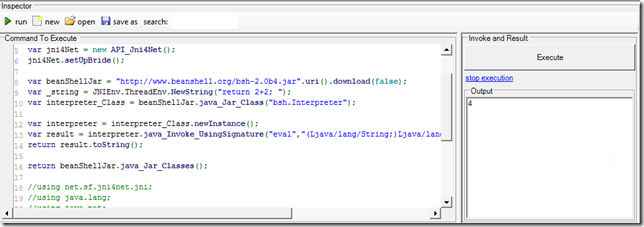

## Invoking Java BeanShell from .Net CLR

Here is a very rough PoC of how I was able to execute a [JavaBean ](http://www.beanshell.org/)shell script from inside the O2 Platform (with the java code executed under a JVM)

Executing _"return 2+2;"_ as a java beanshell comand (see result on the bottom right Output pane)  

    var jni4Net = new API_Jni4Net();  
    jni4Net.setUpBride();

    var beanShellJar = "http://www.beanshell.org/bsh-2.0b4.jar".uri().download(false);  
    var _string = JNIEnv.ThreadEnv.NewString("return 2+2; ");  
    var interpreter_Class = beanShellJar.java_Jar_Class("bsh.Interpreter");

    var interpreter = interpreter_Class.newInstance();  
    var result = interpreter.java_Invoke_UsingSignature("eval","(Ljava/lang/String;)Ljava/lang/Object;",_string);  
    return result.toString();

    return beanShellJar.java_Jar_Classes();

    //using net.sf.jni4net.jni;  
    //using java.lang;  
    //using java.net;  
    //O2File:API_Jni4Net.cs  
    //O2Ref:jni4net.n-0.8.6.0.dll  
