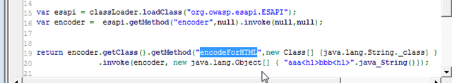
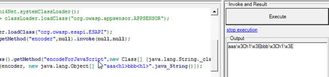
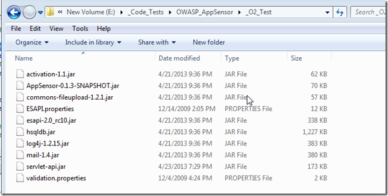

##  First execution of ESAPI.jar Encoder methods from O2's C# REPL

In April 2013 (when preparing to do the [OWASP AppSensor and O2 Platform at Security B-Sides London](http://blog.diniscruz.com/2013/04/owasp-appsensor-and-o2-platform-at.html) workshop with colin), I achieved something that I have been trying to do for a while:

* Use the [O2 Platform](http://blog.diniscruz.com/p/owasp-o2-platform.html)'s [C# REPL](http://blog.diniscruz.com/p/c-repl-script-environment.html) environment to programatically access (in real time) the [ESAPI jar ](https://www.owasp.org/index.php/Category:OWASP_Enterprise_Security_API)apis and methods.
* consume *AppSensor's* jar directly from a .NET app (in that case TeamMentor)

When I was integrating AppSensor (java) with TeamMentor (.NET) I needed to solve the the problem described in *Loading OWASP ESAPI jar and its dependencies from C#* since AppSensor has an hard dependency on ESAPI (i.e. without ESAPI, AppSensor doesn't work)

After a bit of research and coding, here is the first code sample that shows ESAPI being consumed from O2 (via Jni4Net)

Note how the ESAPI Encoder's **_encodeForHTML_** method is being executed:

And displayed in the Output window:

To to clarify, although this code is being triggered and executed from a .Net GUI and CLR, the actual code that is doing the encoding is the one from [http://owasp-esapi-java.googlecode.com/svn/trunk_doc/latest/org/owasp/esapi/Encoder.html](http://owasp-esapi-java.googlecode.com/svn/trunk_doc/latest/org/owasp/esapi/Encoder.html) which is running running on a JVM inside the same process as the CLR (the magic sauce is provided by the amazing [Jni4Net](http://blog.diniscruz.com/search/label/Jni4Net))

For example here is the execution result of the ESAPI Encoder's **_encodeForJavascript_**:

Which is exactly what I wanted :)

I wonder if we can also execute the current ESAPI unit test the same way? For example, now that we have the capability to see what the encodings output of the Java version of ESAPI look like, we can try to compare it with the ESAPI .NET methods (since they should match right?)

Here is code sample shown in this post is here:

{lang="csharp"}
    var jni4Net = new API_Jni4Net();
    jni4Net.setUpBride();
    var jarPath = @"E:\_Code_Tests\OWASP_AppSensor\_O2_Test";
    var jars = jarPath.files("*.jar");

    var classLoader = jni4Net.systemClassLoader().loadJars(jars);
    var esapi = classLoader.loadClass("org.owasp.esapi.ESAPI");
    var encoder =  esapi.getMethod("encoder",null).invoke(null,null);

    return encoder.getClass().getMethod("encodeForJavaScript",new Class[] {java.lang.String._class} )
        	  .invoke(encoder, new java.lang.Object[] { "aaa<h1>bbb<h1>".java_String()});

    //using net.sf.jni4net.jni;
    //using java.lang;
    //using java.net;
    //O2File:API_Jni4Net.cs
    //O2Ref:jni4net.n-0.8.6.0.dll

Here is the current folder set-up and jars loaded:

A key to make it work is the fact that the ESAPI.properties file is in the same path as the ESAPI.jar
