##  Another step in the use of ESAPI and AppSensor Jars from .Net/C# (using Jni4Net) 

Yesterday at the [OWASP EU Tour London Chapte](https://www.owasp.org/index.php/EUTour2013_London_Agenda)r event meeting I presented the next step of my research on using ESAPI and AppSensor inside a .NET application like TeamMentor (using Jni4Net to allow the JVM to work side by side with the CLR).

The source code of the demo I presented is posted to the [github.com:DinisCruz/TeamMentor_3_3_AppSensor](http://github.com:DinisCruz/TeamMentor_3_3_AppSensor) repo, and this post shows a number of screenshots of what is in there.

I used **TeamMentor's TBot C# **and **AngularJS** pages to create the prototypes (since it is very easy and fast to code in that enviroment)  
  
The pages were added to the main **_TBot _**control panel, in 3 new sections: **AppSensor**, **AppSensor/ESAPI** and **AppSensor/JVM**:

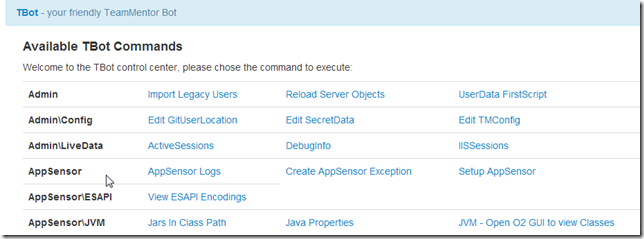

Let's look at all of them and see what they do.

**JavaProperties**  
  
Shows the Properties of the current JVM, and is a good first script to run (since it shows that the Jni4Net CLR to JVM bridge is correctly set up)

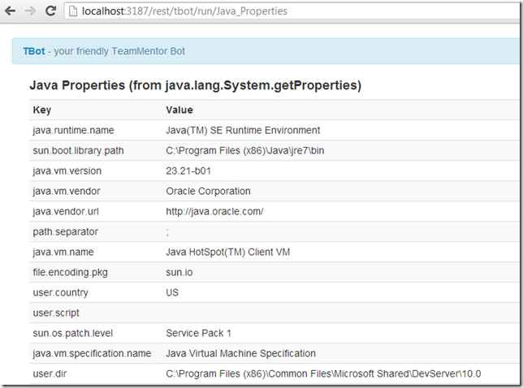

**Jars_In_Class_Path**

This one shows the Jar's currently loaded and some details about the loaded classes

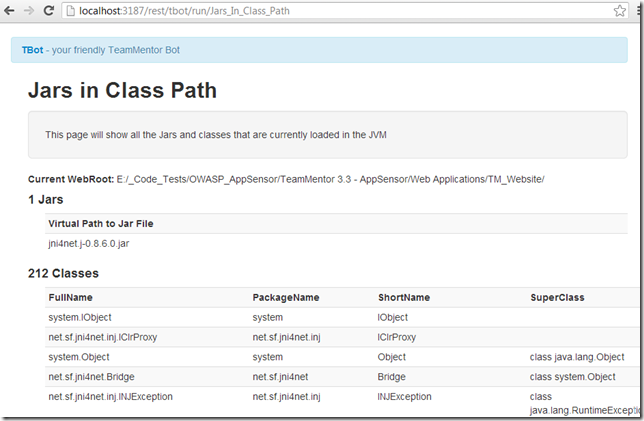

The image above shows that there is only one jar loaded at start (**jni4net.j-0.8.6.0.jar**) and below is what it looks after the _**Setup AppSensor**  _Tbot page is executed

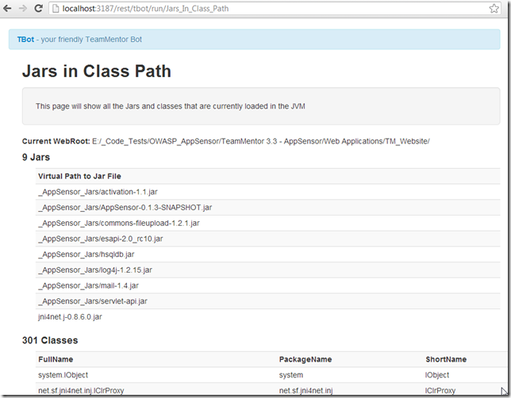

**Setup AppSensor**  

This will load up the AppSensor Jars and perform a simple test to see if one of the expected classes can be loaded

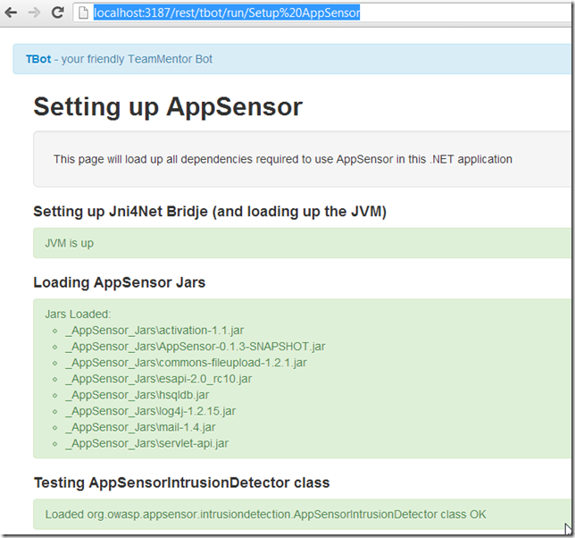

**View_ESAPI_Encodings**  

Once we have the ESAPI loaded we can open up this page that shows **what all the ESAPI encodings looks like**

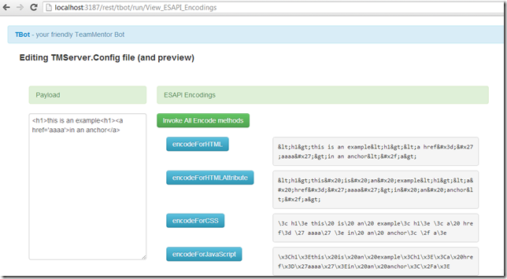

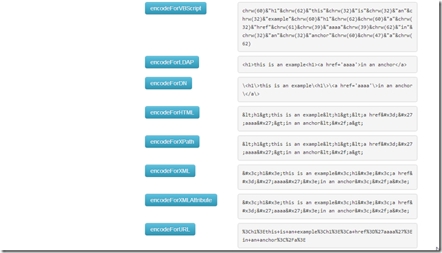

Note how many they are: **encodeForHTML , encodeForHTMLAttribute, encodeForCSS, encodeForJavascript, encodeForVBScript, encodeForLDAP, encodeForDN, encodeForXPath, encodeForXML, encodeForXmlAttribute, encodeForURL**  
**  
**You can use this GUI to try out what a specific encoding looks like.

For example change the text on the left and click on of the **_'encodeFor...'_** buttons

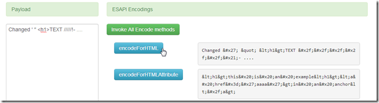

**AppSensor_Logs**  

Shows the currently registered logs

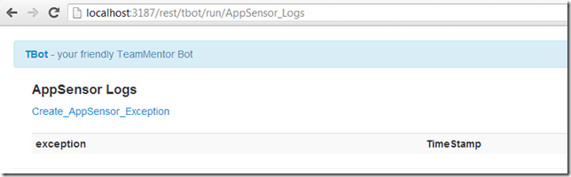

To help to create a new log entry, this page provides a link to:

**Create_AppSensor_Exception**

which looks like this:

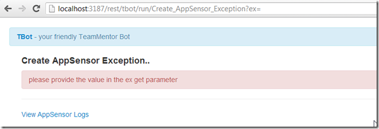

This page (for testing) allows the use of the **ex **querystring parameter to create a new AppSensor log message

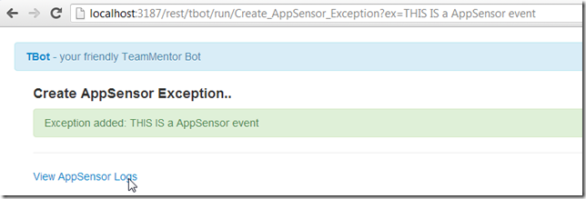

and clicking on **View AppSensor Logs**, which show details of the log:

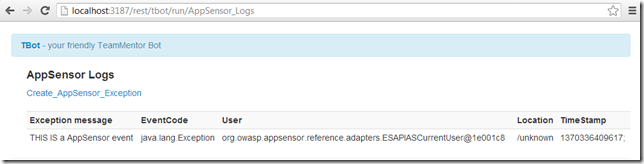
