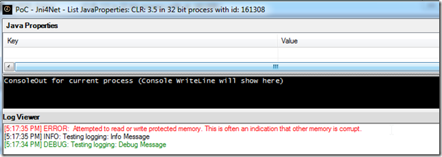
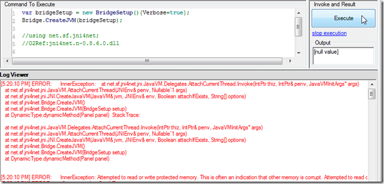
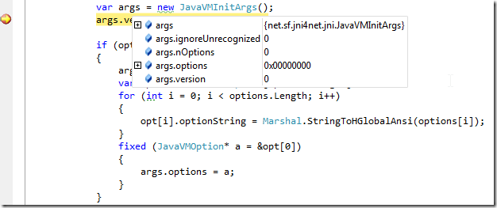
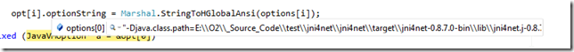
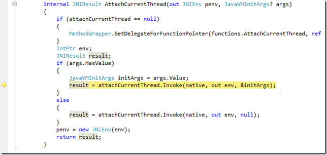
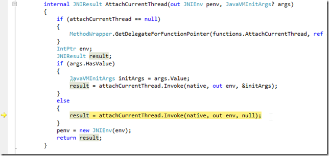
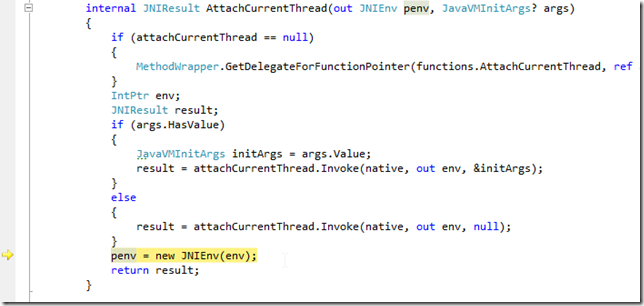

## Reproducing the 'Attempted to read or write protected memory' issue

I used to get this error when trying to connect to a java process like ZAP:

Which we can inject O2 into

When executing the **PoC - Jni4Net - List JavaProperties.h2** process, I get an unmanaged error (which is always a worse case scenario in the .NET Interop world)

As the (simpler script shows), the error happens on the  **CreateJVM** invocation

My next step was to create a local build of Jni4Net (which you saw on the preview note) and to use it to attach into an existing running ZAP with an O2 REPL injected.

Here is the moment when I have VisualStudio hooked, the script compiled (in the ZAP REPL), the jni4net dll loaded (with Symbols) in VisualStudio and a breakpoint on the CreateJVM method:

Here is where I think the problem exists:

the args object (created via JNI) seems to be empty.

It is then assigned to the value of the Jni4Net class path string

The args object is used here:

And inside that method, if I let **args** to be used, we will get the **'Attempted to read or write protected memory'** error

but, if I change the execution path (manually) and set it to the line below (where no args is passed)

Then the execution will be ok (note that the path with the &initArgs would had thrown an **'Attempted to read or write protected memory'**  by now):

The only problem with this approach (which is basically not adding the classpath clue to the current JVM) is that unless we manually add the jni4net jar to the target app, we will get an exception here:

i.e. br.handle would be 0 (meaning that the **net.sf.jnin4net.Bridge** class could not be found)
