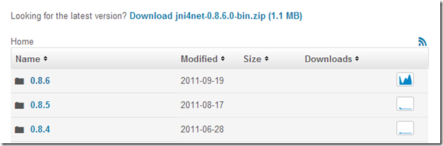
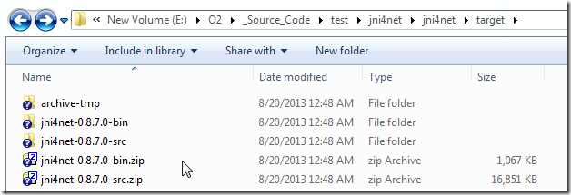
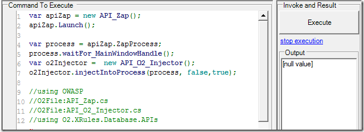
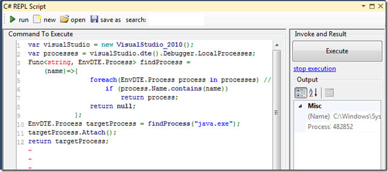
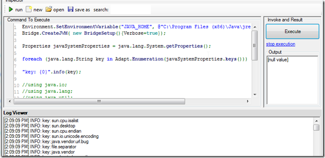
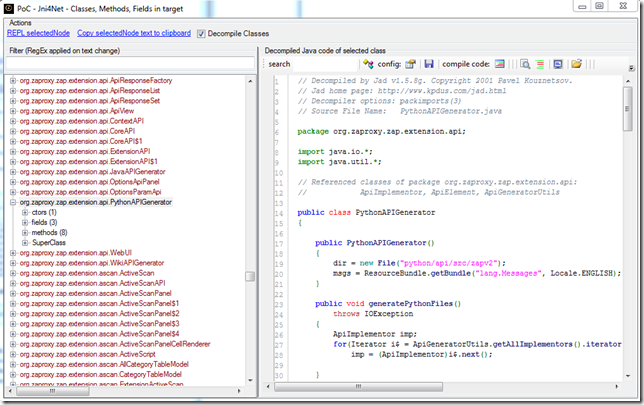
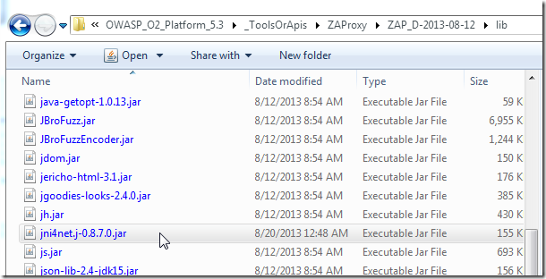

##  Consuming a forked version of Jni4Net

An O2 user was having some issues with my Jni4Net scripts, and after some research, I realized that the problem existed inside the current published **jni4net.n-0.8.6.0.dll**:

The problem is that with the 0.8.6 version we get an **'Attempted to read or write protected memory'** error when trying to connect to an existing Java process we previously injected O2 into.

The solution is to use the latest version of Jni4Net, which is not available for direct download, but its code it at: **http://jni4net.googlecode.com/svn jni4Net**

After getting the compilation and generation process right (see *Dealing with 'Attempted to read or write protected memory*), I had this folder:

I was then able to write these scripts (which worked):

**1) start ZAP and inject O2 into the new process:**

{lang="csharp"}
    var apiZap = new API_Zap();
    apiZap.Launch();
    var process = apiZap.ZapProcess;
    process.waitFor_MainWindowHandle();
    var o2Injector =  new API_O2_Injector();  			
    o2Injector.injectIntoProcess(process, false,true);    

    //using OWASP
    //O2File:API_Zap.cs
    //O2File:API_O2_Injector.cs
    //using O2.XRules.Database.APIs

**2) hook VisualStudio to that process** (assumes there is only one java.exe process)  

{lang="csharp"}
    var visualStudio = new VisualStudio_2010();
    var processes = visualStudio.dte().Debugger.LocalProcesses;
    Func<string, EnvDTE.Process> findProcess =
      (name)=>{
    				foreach(EnvDTE.Process process in processes) //linq doesn't work here
    					if (process.Name.contains(name))
    						return process;
    				return null;
    			};
    EnvDTE.Process targetProcess = findProcess("java.exe");
    targetProcess.Attach();
    return targetProcess;

**3) create bridge and output java properties** (inside the ZAP REPL)

{lang="csharp"}
    Environment.SetEnvironmentVariable("JAVA_HOME", @"C:\Program Files (x86)\Java\jre7");
    Bridge.CreateJVM( new BridgeSetup(){Verbose=true});

    Properties javaSystemProperties = java.lang.System.getProperties();

    foreach (java.lang.String key in Adapt.Enumeration(javaSystemProperties.keys()))

    "key: {0}".info(key);

    //using java.io;
    //using java.lang;
    //using java.util;
    //using net.sf.jni4net;
    //using net.sf.jni4net.adaptors;
    //O2Ref:E:\O2\_Source_Code\test\jni4net\jni4net\target\jni4net-0.8.7.0-bin\lib\jni4net.n-0.8.7.0.dll

4) Executed **PoC - Jni4Net - Classes, Methods, Fields in target.h2** script (inside ZAP process)

which listed all loaded java classes (and its decompiled code):

To make this work (and deal with the **'Attempted to read or write protected memory'** prob) I had to copy the **jni4net.j-0.8.7.0.jar** to the ZAP default class path and manually skip a bit of code when connected to VisualStudio

