## Compiling Jni4Net from Source

After using the *git svn clone -s http://jni4net.googlecode.com/svn jni4Net* command, to create a local clone of the SVN repo:

I started by opening the **jni4net.sln** file in VS 2010.

But on first compile I had this error:

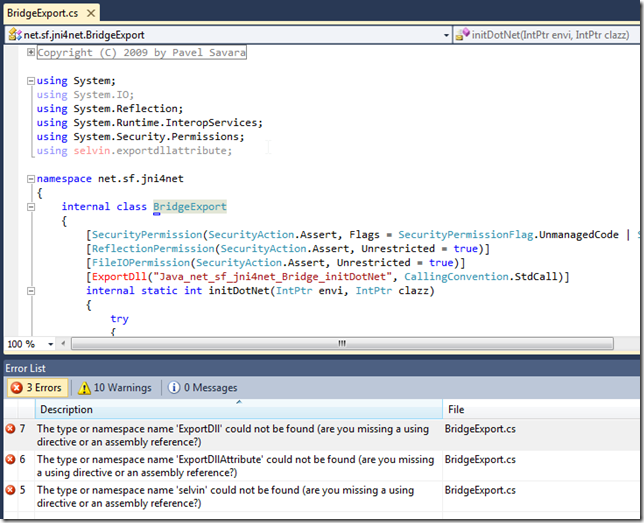

which was created by the missing **selvin.exportdllattribute-0.2.6.0.dll**

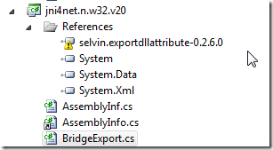

which looks like should be here:

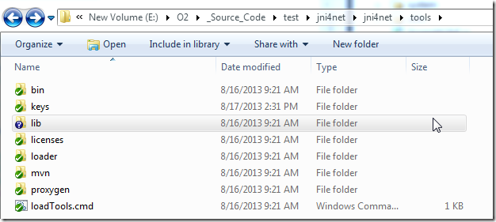

let's take a look at the **v0-8-generics** branch

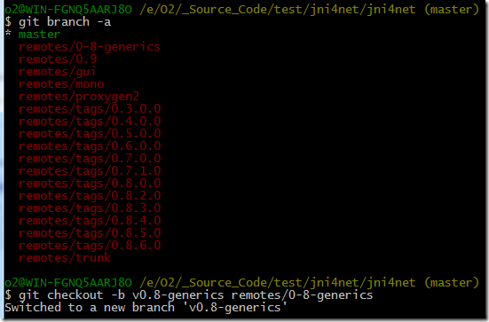

Since it is also not there, I just downloaded it from:

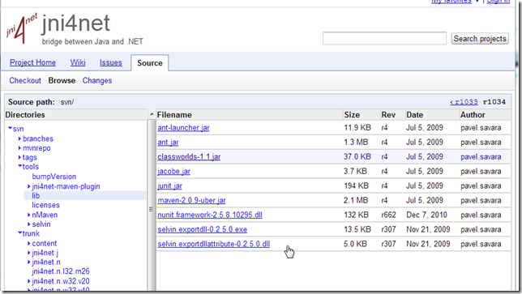

... and saved it to:

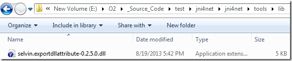

... and updated the references

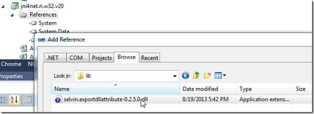

Now the code compiles, but we get this error:

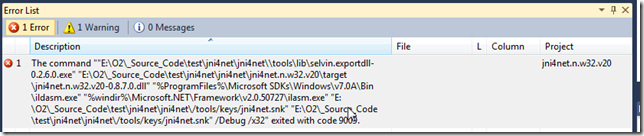

... which is caused by this post build command:

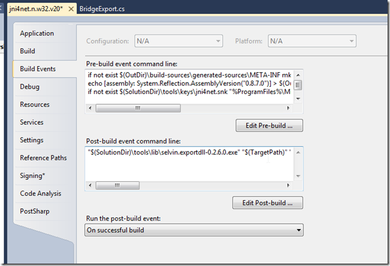

... and is resolved by downloading this file:

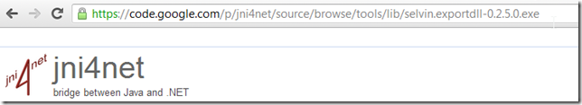

... into this folder:

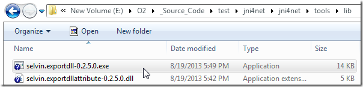

I was able to get it to compile by changing the **selvin.exportdll-0.2.6.0.exe** to **selvin.exportdll-0.2.5.0.exe** (couldn't find the 0.2.6.0 version)

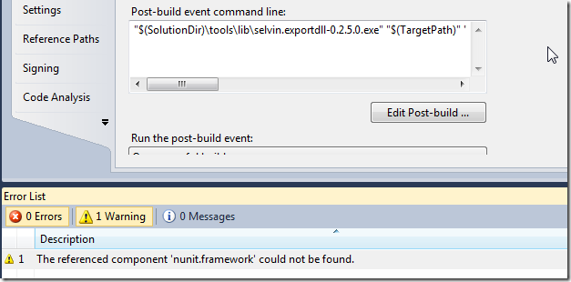

Next there was a bunch of NUnit errors, which were resolved using

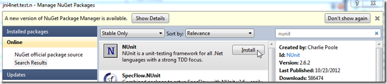

Now we have a clean compilation (with only a bunch of warnings)

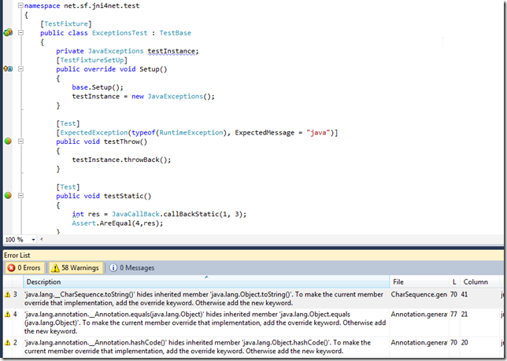

But, they all fail to execute:

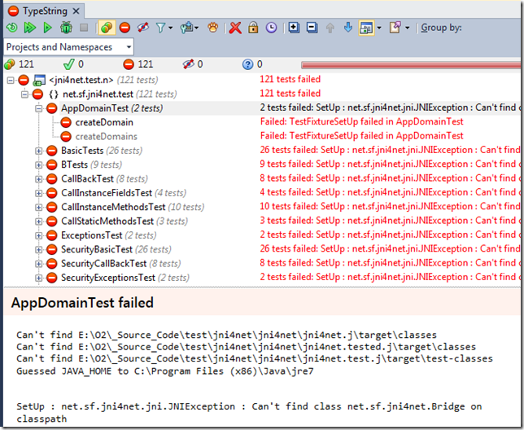

This was a good sign that I should look for a readme.txt, which I found in the repo root (ie. RTFM when everything else fails :) )

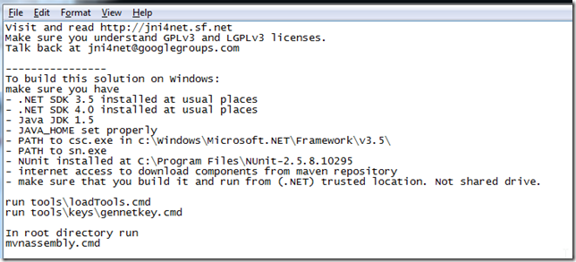

From that file I got the clue to run the loadTools.cmd script:

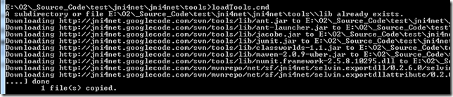

... which downloads the missing files into the lib folder:

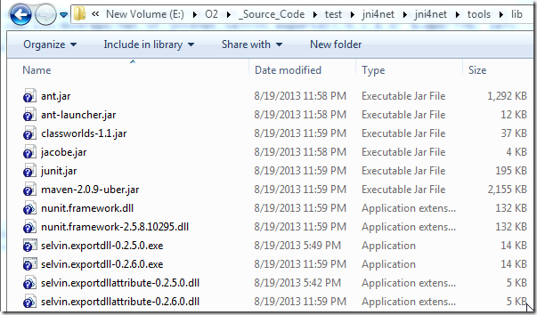

Since we now have the 0.2.6.0 versions, I updated back the VS solution (and removed the nUnit package from Nuget)

Then I executed

... and

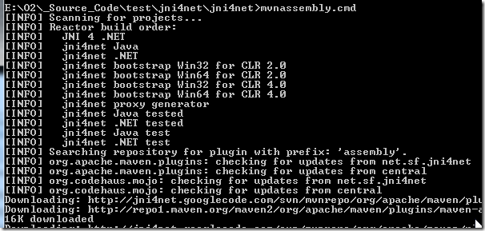

... this took a while, and although most looked ok:

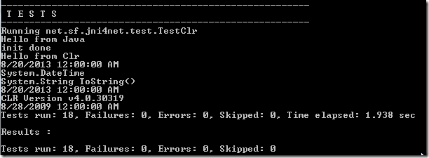

... the last one failed:

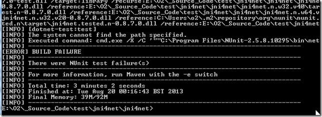

That said, it looked like the required files seemed to have been created:

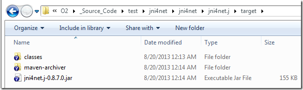

And the Unit tests now pass:

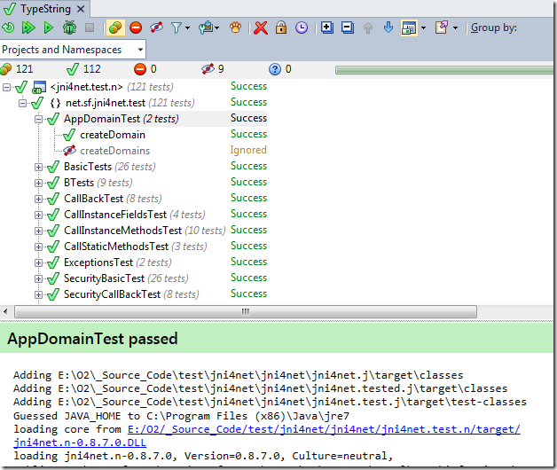

I didn't like the fact that we had that build error, so I tracked the problem to a missing NUnit installation:

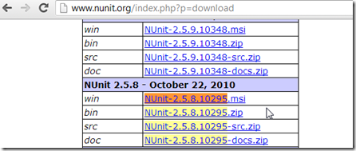

Since I'm on a x64 VM and the path is hard-coded in the Maven script, I had to copy the installed nunit files into the expected folder:

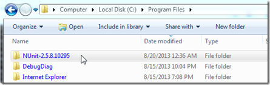

... which didn't work

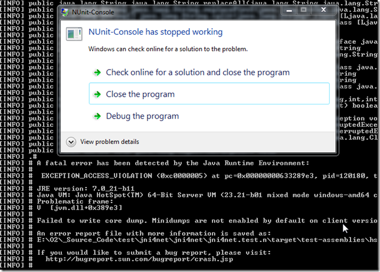

The problem was caused by the fact that I'm currently using an x64 JDK:

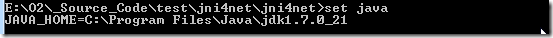

Forcing a x86 (32bit) version of the JDK will do the trick

Since the tests expect to find Nunit in the (x86) folder:

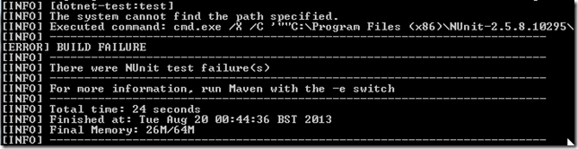

We need to rename the **NUnit-2.5.8** folder to the expected value:

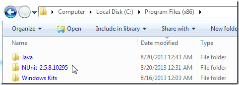

Finally we have a successful complete build:

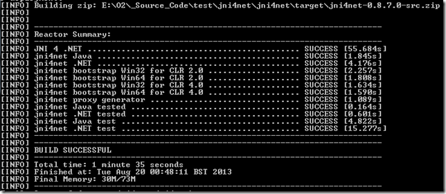

... with all created files placed inside the target folder:

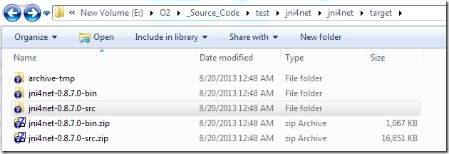
