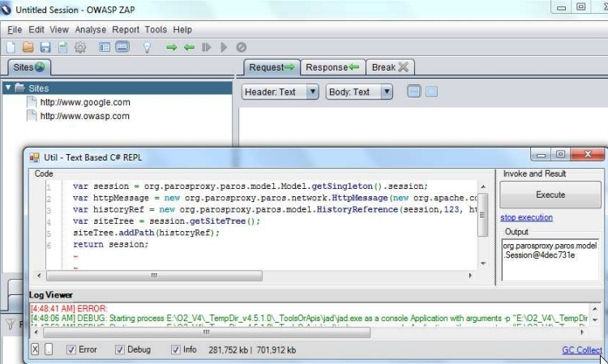

## Controlling OWASP ZAP remotely (via Java BeanShell REPL in .Net)

Once I was able to use C# REPL in java process I was able to use the ZAP [BeanShell](http://www.beanshell.org/) support to start controlling and manipulating ZAP's GUI from the .Net C# REPL.

Here is an example of adding a new 'Site' (i.e. a TreeNode) to the main ZAP 'Site's window (i.e. TreeView)

For more details on how this PoC was created, take a look at
https://bintray.com/artifact/download/dinis-cruz/Books/Using-Jni4Net-Part-2.pdf
