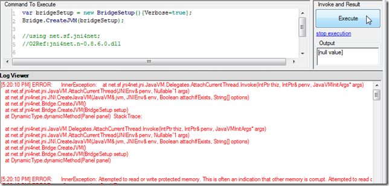
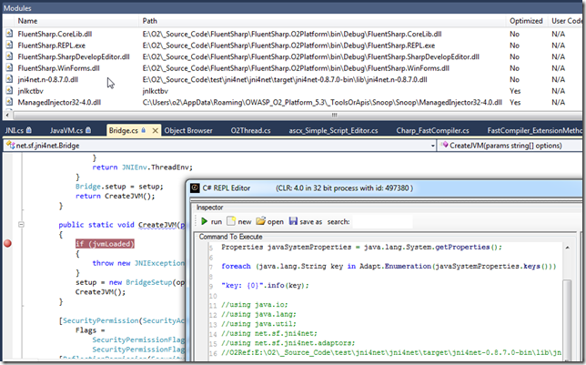
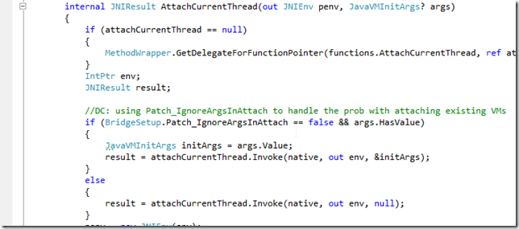
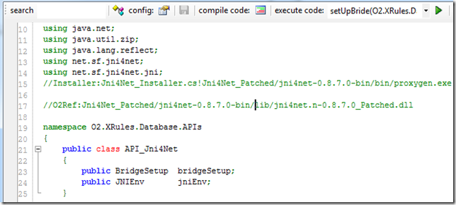
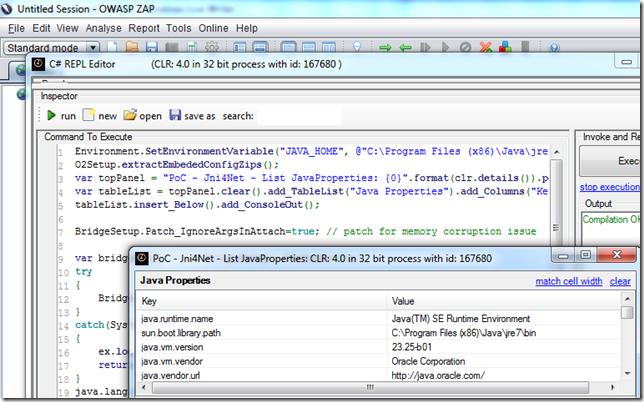
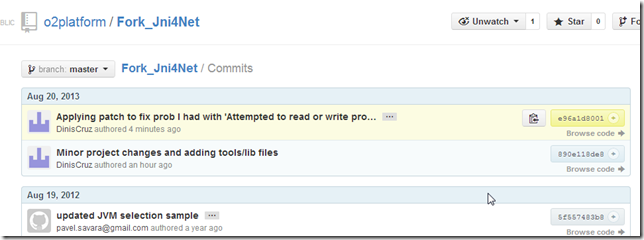
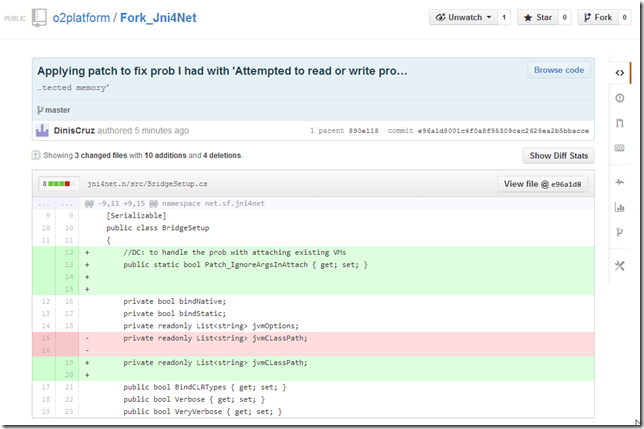
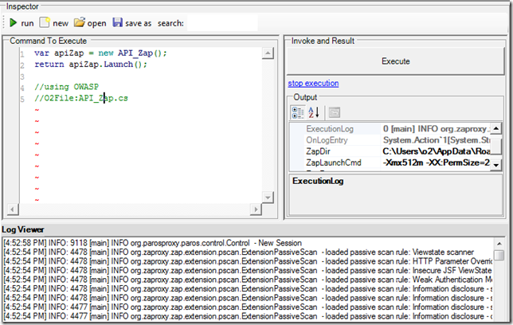

## Dealing with 'Attempted to read or write protected memory

**NOTE XYZ)** replicating the original **'Attempted to read or write protected memory'** error

get this error when trying to connect to a java process like ZAP:

which we can inject O2 into

And if I try to execute the **_PoC - Jni4Net - List JavaProperties.h2_** process, I get an unmanaged error (which is always a worse case scenario in the .NET Interop world)

As the (simpler script shows), the error happens on the  **_CreateJVM_** invocation

My next step was to create a local build of Jni4Net (which you saw on the preview note) and to use it to attach into an existing running ZAP with an O2 REPL injected.

Here is the moment when I have VisualStudio hooked, the script compiled (in the ZAP REPL), the jni4net dll loaded (with Symbols) in VisualStudio and a breakpoint on the CreateJVM method:

Here is where I think the problem exists:

the args object (created via JNI) seems to be empty.

It is then assigned to the value of the Jni4Net class path string

The args object is used here:

And inside that method, if I let **_args_** to be used, we will get the **_'Attempted to read or write protected memory'_** error

but, if I change the execution path (manually) and set it to the line below (where no args is passed)

Then the execution will be ok (note that the path with the &initArgs would had thrown an **_'Attempted to read or write protected memory'_**  by now):

The only problem with this approach (which is basically not adding the classpath clue to the current JVM) is that unless we manually add the jni4net jar to the target app, we will get an exception here:

i.e. br.handle would be 0 (meaning that the **_net.sf.jnin4net.Bridge_** class could not be found)

**Note AAA) Fixing the issue**

I added the **_Patch_IgnoreArgsInAttach_** property

Which is then used here (to allow the selection of the path that works)

I also changed the assembly name (so it is easy to track its use):

After the compilation I copied it to the main target folder:

To test it , I used the script

]

to start ZAP with a REPL, where I could execute OK:

Final step is to create a zip of the bin folder

Put it on a public [available location like DropBox](https://dl.dropboxusercontent.com/u/81532342/O2%20Files/jni4net-0.8.7.0-bin_Patched.zip)

Update the installer API to use that version:

Update the API_Jni4Net.cs to use the jni4net.n-0.8.7.0_Patched.dll assembly (as seen below on first compile the referenced will be downloaded)

once the compilation works:

Running Jni4Net works locally

And so does on 'injected into' java processes:

Finally I can add a remote to the local repo:

push it

And confirm that the commits I did locally (with the patch)

where pushed successfully:

**NOTE ABC) Starting ZAP programmatically**

Here is a script that starts (and downloads on first run) the latest version of ZAP (return value is the new ZAP process, and ZAP's console out are being captured in the O2's LogViewer):

Here is the contents of the API_Zap.cs file (consumed above):

**Note #2) Setting default folders**

In this case I also had to update the location of the temp and O2.Platform.Scripts folder (usually not needed)

