## Fixing the 'Attempted to read or write protected memory' issue

This error happened when running a java process (like ZAP):

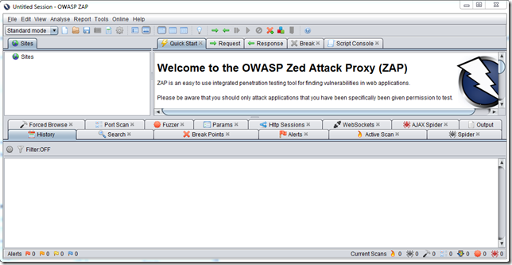

...with the O2 Platform REPL injected into:

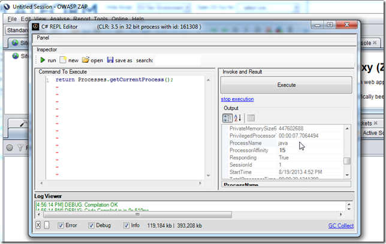

... and executing **PoC - Jni4Net - List JavaProperties.h2** scrit, resulted in an unmanaged error (which is always a worse case scenario in the .NET Interop world)

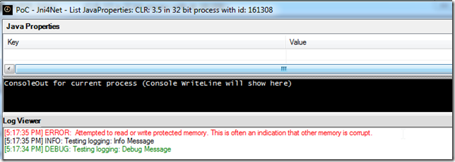

As the (simpler script shows), the error happens on the  **CreateJVM** invocation

My next step was to create a local build of Jni4Net (see *Compiling Jni4Net from Source*) and to use it to attach into an existing running ZAP with an O2 REPL injected.

Here is the moment when I have VisualStudio hooked, the script compiled (in the ZAP REPL), the jni4net dll loaded (with Symbols) in VisualStudio and a breakpoint on the *CreateJVM* method:

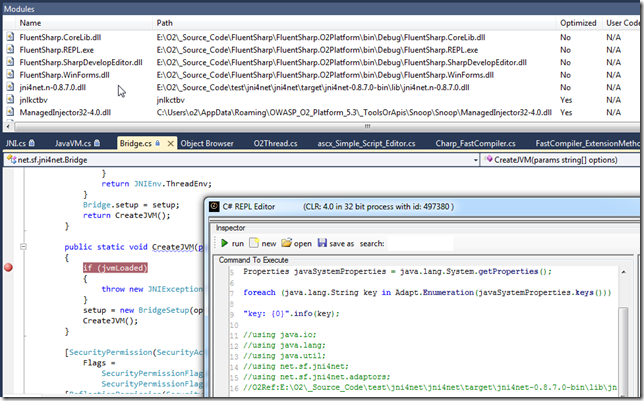

Here is where I think the problem exists:

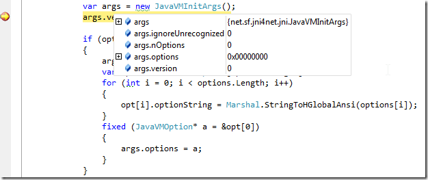

The args object (created via JNI) seems to be empty.

It is then assigned to the value of the Jni4Net class path string

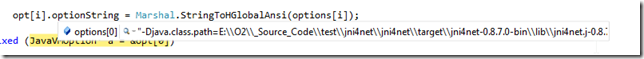

The args object is used here:

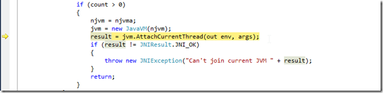

And inside that method, if I let **args** to be used, we will get the **'Attempted to read or write protected memory'** error

But, if I change the execution path (manually) and set it to the line below (where no args is passed)

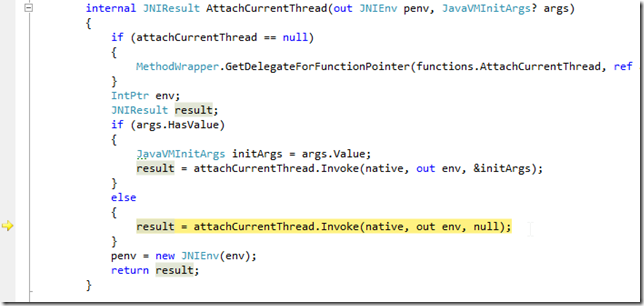

Then the execution will be ok (note that the path with the *&initArgs* would had thrown an **'Attempted to read or write protected memory'**  by now):

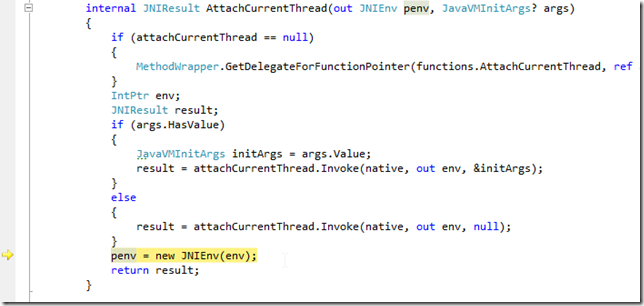

The only problem with this approach (which is basically not adding the classpath clue to the current JVM) is that unless we manually add the jni4net jar to the target app, we will get an exception here:

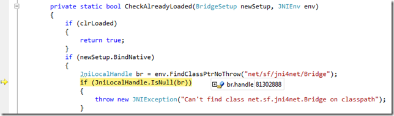

i.e. br.handle would be 0 (meaning that the **net.sf.jnin4net.Bridge** class could not be found)

To fix it, I added the **Patch_IgnoreArgsInAttach** property

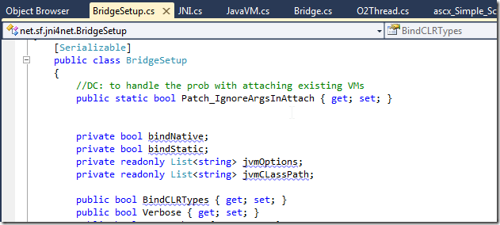

... which is then used here (to allow the selection of the path that works)

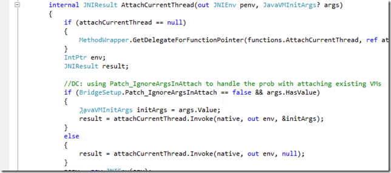

I also changed the assembly name (so it is easy to track its use):

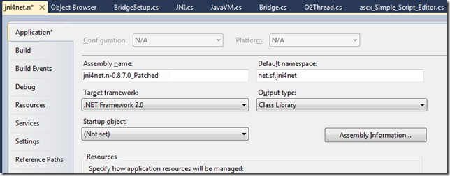

After the compilation I copied it to the main target folder:

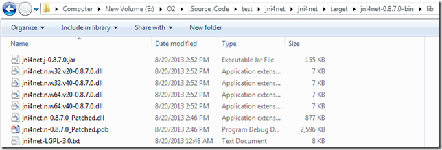

To test it , I used the script

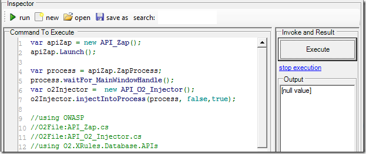

... to start ZAP with a REPL, where I could execute OK:

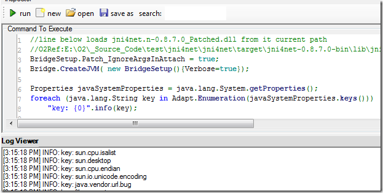

Final step is to create a zip of the bin folder

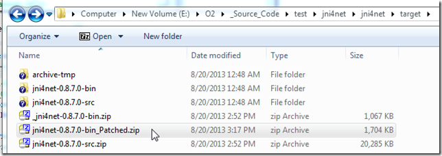

Put it on a public [available location like DropBox](https://dl.dropboxusercontent.com/u/81532342/O2%20Files/jni4net-0.8.7.0-bin_Patched.zip)

Update the installer API to use that version:

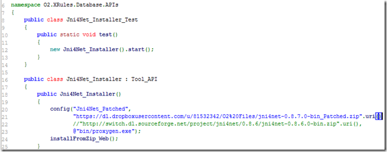

Update the API_Jni4Net.cs to use the jni4net.n-0.8.7.0_Patched.dll assembly (as seen below on first compile the referenced will be downloaded)

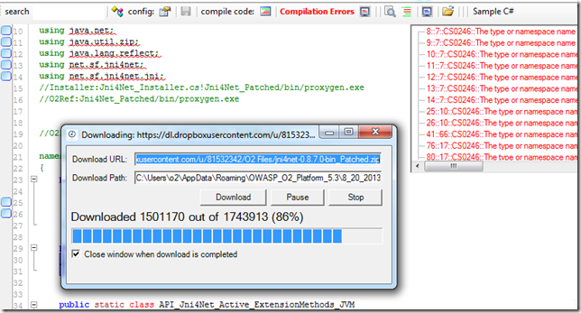

... once the compilation works:

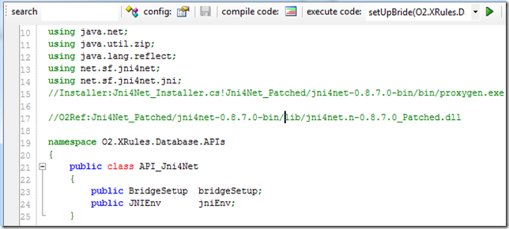

I was able to to run Jni4Net in the main O2 Platform process

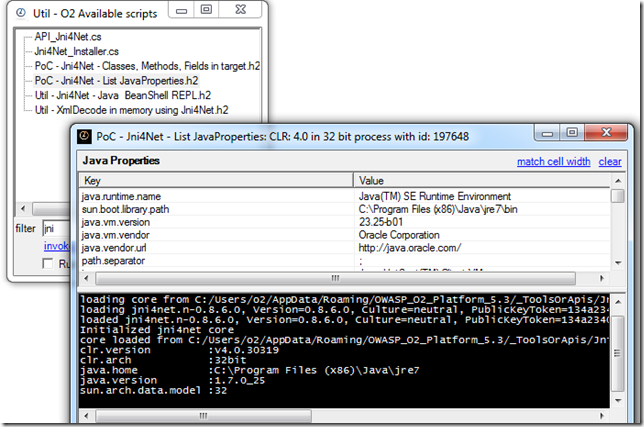

...and on the 'injected into' java processes:

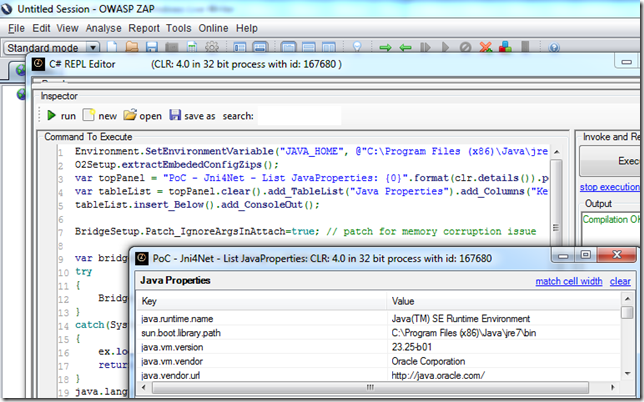

### Pushing changes to GitHub

Once the fix was working ok I added a remote to the local repo:

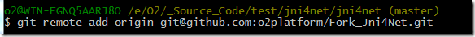

... push it

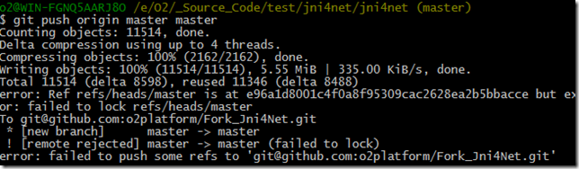

... and confirm that the commits I did locally (with the patch)

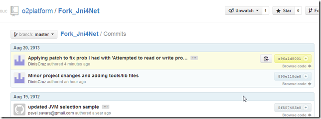

... where pushed successfully:

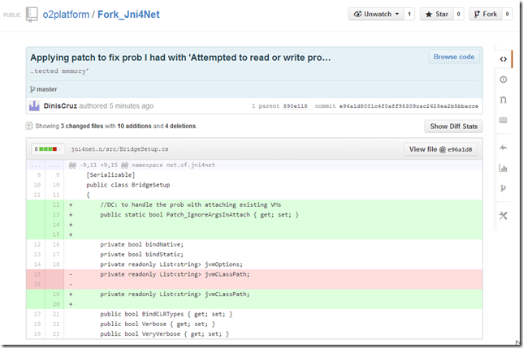
