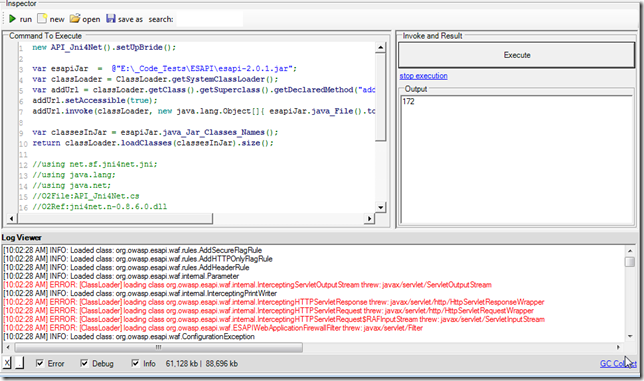

##  Loading OWASP ESAPI jar and its dependencies

Here is a pretty cool PoC where I was able to load an jar file and its dependencies into an '[Jni4Net](http://jni4net.sourceforge.net/) created' JVM

### Using the system class loader

This is the ESAPI class we want to load (the code below returns null)  

{lang="csharp"}
    new API_Jni4Net().setUpBride();
    return "org.owasp.esapi.util.ObjFactory".java_Class();  

Using the technique shown in [Adding files to java classpath at runtime - Stack Overflow](http://stackoverflow.com/questions/1010919/adding-files-to-java-classpath-at-runtime) , we can add the esapi jar into the sysLoader class path  

{lang="csharp"}
    new API_Jni4Net().setUpBride();

    var esapiJar = @"E:\_Code_Tests\ESAPI\esapi-2.0.1.jar";  
    var classLoader = ClassLoader.getSystemClassLoader();  
    var addUrl = classLoader.getClass().getSuperclass().getDeclaredMethod("addURL", new Class[]{URL._class});  
    addUrl.setAccessible(true);  
    addUrl.invoke(classLoader, new java.lang.Object[]{ esapiJar.java_File().toURL() });

    return "org.owasp.esapi.util.ObjFactory".java_Class();

    //using net.sf.jni4net.jni;  
    //using java.lang;  
    //using java.net;  
    //O2File:API_Jni4Net.cs  
    //O2Ref:jni4net.n-0.8.6.0.dll  

which will now work:

If we now try to load all classes in the ESAPI jar, we will get 172 classes and a number of class load errors (due to missing jars references)

Let's refactor the code and create the **_addJarToSystemClassLoader_** method

And load one of the dependencies (note the increased number of classes loaded (183)):

And now if we load all jars in the libs folder (all 30 of them), we will get 197 classes and no load errors

Here are the jars added to the classpath:

Here is the code (shown above) that loaded all esapi classes into the system class path:

{lang="csharp"}
    new API_Jni4Net().setUpBride();

    var classLoader = ClassLoader.getSystemClassLoader();

    Action<string> addJarToSystemClassLoader =   
        (pathToJar)=>{   
                        var addUrl = classLoader.getClass()  
                                                .getSuperclass()  
                                                .getDeclaredMethod("addURL", new Class[]{URL._class});  
                        addUrl.setAccessible(true);  
                        addUrl.invoke(classLoader, new java.lang.Object[]{ pathToJar.java_File().toURL() });   
                     };

    var esapiJar = @"E:\_Code_Tests\ESAPI\esapi-2.0.1.jar";  
    var esapiLibs = @"E:\_Code_Tests\ESAPI\libs";

    addJarToSystemClassLoader(esapiJar);  
    foreach(var jarFile in esapiLibs.files("*.jar"))  
        addJarToSystemClassLoader(jarFile);

    var classesInJar = esapiJar.java_Jar_Classes_Names();  
    return classLoader.loadClasses(classesInJar).size();

    //using net.sf.jni4net.jni;  
    //using java.lang;  
    //using java.net;  
    //O2File:API_Jni4Net.cs  
    //O2Ref:jni4net.n-0.8.6.0.dll  

Once these classes are loaded we can use the tool shown in **C# REPL a java process (ZAP Proxy)** to browse them and view its source code:

We can now create instances of ESAPI using reflection.

One problem to solve is the need to define where the ESAPI.properties file is:

{lang="csharp"}
    new API_Jni4Net().setUpBride();
    var classLoader = ClassLoader.getSystemClassLoader();

    var arrayList = "java.util.ArrayList".java_Class().newInstance();

    return "org.owasp.esapi.reference.DefaultSecurityConfiguration".java_Class().newInstance();

    var easpi = "org.owasp.esapi.ESAPI".java_Class();  
    return easpi.getMethod("encoder",null).invoke(null,null);  
    return easpi.newInstance().typeFullName();  

The code above will throw an error on line 439 of the **_DefaultSecurityConfiguration_** file

which is:

### Using a separate class loader

Here is a script that loads 172 classes from the ESAPI jar  

{lang="csharp"}
    var jni4Net = new API_Jni4Net();  
    jni4Net.setUpBride();

    var esapiJar = @"E:\_Code_Tests\ESAPI\esapi-2.0.1.jar";   
    var classLoader = (new URL[] {esapiJar.java_File().toURL() }).java_ClassLoader_forJars();

    return classLoader.loadClasses(esapiJar.java_Jar_Classes_Names()).size();

    //using net.sf.jni4net.jni;  
    //using java.lang;  
    //using java.net;  
    //O2File:API_Jni4Net.cs  
    //O2Ref:jni4net.n-0.8.6.0.dll  

This version will load 183 classes since we are also loading the servlet-api  

{lang="csharp"}
    var jni4Net = new API_Jni4Net();  
    jni4Net.setUpBride();  
    var servletApi = @"E:\_Code_Tests\ESAPI\libs\servlet-api-2.4.jar";  
    var esapiJar  =  @"E:\_Code_Tests\ESAPI\esapi-2.0.1.jar";   
    var classLoader = (new URL[] {esapiJar.java_File().toURL() , servletApi.java_File().toURL() }).java_ClassLoader_forJars();

    return classLoader.loadClasses(esapiJar.java_Jar_Classes_Names()).size();  
    //using net.sf.jni4net.jni;  
    //using java.lang;  
    //using java.net;  
    //O2File:API_Jni4Net.cs  
    //O2Ref:jni4net.n-0.8.6.0.dll  
