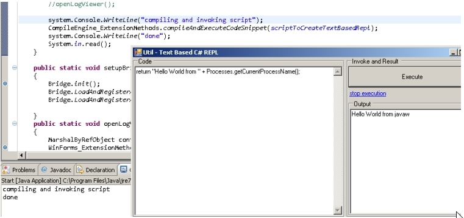
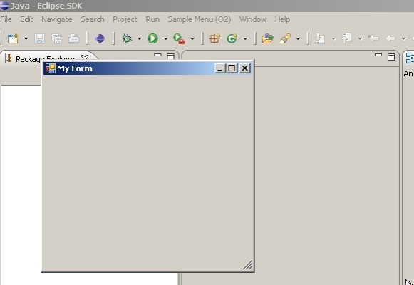
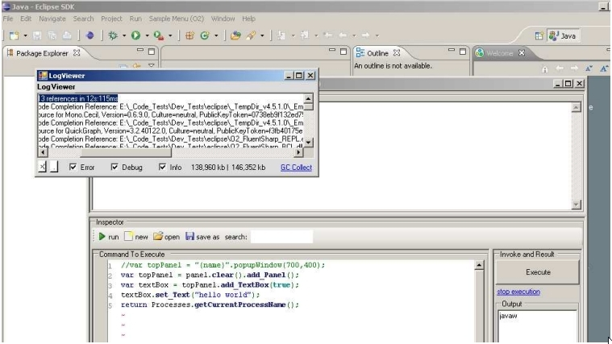

##  Writing and Invoking O2 Methods from Java and Eclipse.pdf

After using C# REPL in java process and controlling OWASP ZAP remotely, the next step was to see if we could consume (and code) the .NET APIs from Java.

And again [Jni4Net](http://jni4net.sourceforge.net/) really worked!

Here is a .NET WinForms control, coded and executed from the (Eclipse written) Java code:

Once we could create *.jar files, it was a small step to create an Eclipse plugin that would load up a CLR and popup a C# based Form.  

Or more interestingly an C# REPL editor (running in the same process as Eclipse):

For more details on how these PoCs were created, take a look at this pdf https://bintray.com/artifact/download/dinis-cruz/Books/Using-Jni4Net-Part-3.pdf
