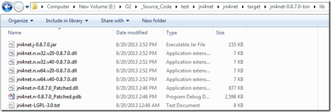
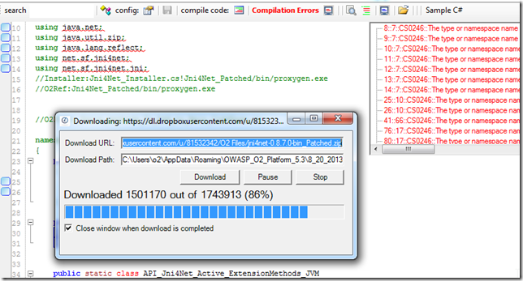

## Fixing the 'Attempted to read or write protected memory' issue

I added the **Patch_IgnoreArgsInAttach** property

Which is then used here (to allow the selection of the path that works)

I also changed the assembly name (so it is easy to track its use):

After the compilation I copied it to the main target folder:

To test it , I used the script

]

to start ZAP with a REPL, where I could execute OK:

Final step is to create a zip of the bin folder

Put it on a public [available location like DropBox](https://dl.dropboxusercontent.com/u/81532342/O2%20Files/jni4net-0.8.7.0-bin_Patched.zip)

Update the installer API to use that version:

Update the API_Jni4Net.cs to use the jni4net.n-0.8.7.0_Patched.dll assembly (as seen below on first compile the referenced will be downloaded)

once the compilation works:

Running Jni4Net works locally

And so does on 'injected into' java processes:

Finally I can add a remote to the local repo:

push it

And confirm that the commits I did locally (with the patch)

where pushed successfully:

**Starting ZAP programmatically**

Here is a script that starts (and downloads on first run) the latest version of ZAP (return value is the new ZAP process, and ZAP's console out are being captured in the O2's LogViewer):

Here is the contents of the API_Zap.cs file (consumed above):

**Setting default folders**

In this case I also had to update the location of the temp and O2.Platform.Scripts folder (usually not needed)

