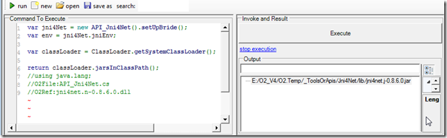

## Getting list of Jars loaded in SystemClassLoader

I just created a couple extension methods for [Jni4Net](http://blog.diniscruz.com/search/label/Jni4Net) that allow (amongst other things) the listing of the jars currently loaded in the SystemClassLoader (see [API_Jni4Net.cs](https://github.com/o2platform/O2.Platform.Scripts/blob/master/3rdParty/Jni4Net/API_Jni4Net.cs) for the code of these .NET Extension Methods)

The objective is to simplify the use of Jni4Net, and to hide the complexity in consuming Java code from .NET.

Here are a couple examples of [these Extension Methods](https://github.com/o2platform/O2.Platform.Scripts/blob/master/3rdParty/Jni4Net/API_Jni4Net.cs) in action:  

When you create a simple Jni4Net bridge there is only one jar loader:

Next lets load a jar dynamically and see it appear in the list of loaded jars

Note that once the jar is loaded we can access its classes:

Create instances and invoke methods:

Here is the script show above:  

{lang="csharp"}
    var jni4Net = new API_Jni4Net().setUpBride();  
    var env = jni4Net.jniEnv;

    var classLoader = ClassLoader.getSystemClassLoader();  
    var beanShellJar = "http://www.beanshell.org/bsh-2.0b4.jar".uri().download(false);

    classLoader.loadJar(beanShellJar);  
    var interpreter_Class = beanShellJar.java_Jar_Class("bsh.Interpreter");

    return interpreter_Class.newInstance()
			    .java_Invoke_UsingSignature("eval",  
                                                        "(Ljava/lang/String;)Ljava/lang/Object;",  
                                                        "return \"hello from java: \" + (2 + 2); "
                                                           .java_String()
                                                       ).str();

    return classLoader.jarsInClassPath();  
    //using java.lang;  
    //O2File:API_Jni4Net.cs  
    //O2Ref:jni4net.n-0.8.6.0.dll  

Finally we can also load/add to the system class path, entire folders with jars. For example all ESAPI dependencies:

