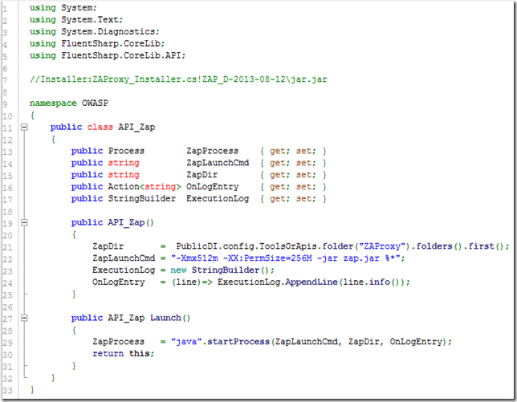
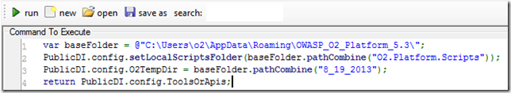

##  Creating a Fork of Jni4Net,dealing with 'Attempted to read or write protected memory' problem and what I had to do to make it work with ZAP 

An O2 user was having some issues with the Jni4Net scripts and I think the root cause is because the current O2 Scripts uses the **_jni4net.n-0.8.6.0.dll _**which is the version currently available for download  

TLDR: The code of the [patched version is here](https://github.com/o2platform/Fork_Jni4Net) the compiled [binaries are here](https://dl.dropboxusercontent.com/u/81532342/O2%20Files/jni4net-0.8.7.0-bin_Patched.zip)

**NOTE: THIS VERSION IS CURRENTLY published as DRAFT** since I'm on the Algarve (i.e. the beach is waiting) and don't have time to proof read the text below (which is posted how I wrote it at the time)

The problem is that with the 0.8.6 version we would get an **_'Attempted to read or write protected memory'_** error when trying to connect to an existing Java process we injected O2 into (see note below for more details)

If I remember correctly (when I was able to make it work before, see [Using Jni4Net part 1](http://blog.diniscruz.com/2012/11/using-jni4net-part-1-to-c-repl-java.html), [part 2](http://blog.diniscruz.com/2012/11/using-jni4net-part-2-controling-owasp.html),  [part 3](http://blog.diniscruz.com/2012/11/using-jni4net-part-3-writing-and.html) and [part 4](http://blog.diniscruz.com/2012/11/jni4net-part-4-integrating-appscan-with.html)) the solution is to use the latest version of Jni4Net, which is not available for direct download, but its code it at: _**http://jni4net.googlecode.com/svn jni4Net**_

Using the _**git svn clone -s http://jni4net.googlecode.com/svn jni4Net **_command, I created a local clone of the SVN repo:  
   
After getting the compilation and generation process right (see below), I had this folder:  
   
I then used these scripts (see [this gist for code](https://gist.github.com/DinisCruz/6281106)) to:  
**1) start ZAP and inject O2 into the new process:**  
   
**2) hook VisualStudio to that process** (assumes there is only one java.exe process)  
   
**3) create bridge and output java properties** (inside the ZAP REPL)  
   
4) Executed **_PoC - Jni4Net - Classes, Methods, Fields in target.h2_** script (inside ZAP process)  
   
which listed all loaded java classes (and its decompiled code):  

To make this work (and deal with the **_'Attempted to read or write protected memory'_** prob) I had to copy the **_jni4net.j-0.8.7.0.jar_** to the ZAP default class path and manually skip a bit of code when connected to VisualStudio  

**NOTE XYZ)**  **How I got the whole compilation process to work**  
I started by opening the **_jni4net.sln_** file in VS 2010.  
But on first compile I had this error:  
   
which was created by the missing **_selvin.exportdllattribute-0.2.6.0.dll_**  
   
which looks like should be here:  
   
let's take a look at the**_ v0-8-generics_** branch  
   
but it is also not there, so I just downloaded it from:  
We can find the file on the tools   
   
... and saved it to:  
   
... updated the references  
   
Now the code compiles, but we get this error:  
   
which is caused by this post build command:  
   
and is resolved by downloading this file:  
   
into this folder:  
   
I was able to get it to compile by changing the **_selvin.exportdll-0.2.6.0.exe_** to _**selvin.exportdll-0.2.5.0.exe **_(couldn't find the 0.2.6.0 version)  
   
Next there was a bunch of NUnit errors, which were resolved using   
   
and now we have a clean compilation (with only a bunch of warnings)  
   
But, they all fail to execute:  
   
Which was a good sign that I should look for a readme.txt, which I found in the repo root:  
   
Running loadTools.cmd:  
   
... downloads the missing files into the lib folder:  
  
Since we now have the 0.2.6.0 versions I updated back the VS solution (and removed the nUnit package from Nuget)  
Then I executed   
   
and   
   
this took a while, and although most looked ok:  
   
it looks like the last one failed:  
   
But the required files seemed to have been created:  
  
And the Unit tests now pass:  
   
I still don't like the fact that we have that build error, so I track it to the missing NUnit installation. So I downloaded and installed the expected one  
   
but since I'm on a x64 VM and the path is hard-coded in the Maven script, I had to copy the installed nunit files to the expected folder:  
   
humm, maybe that wasn't such a good idea:  
   
I think the problem could be caused by the fact that I'm currently using an x64 JDK:  
   
So let's try with a x86 (32bit) version of the JDK  
   
now the tests expect to find Nunit in the (x86) folder:  
   
which should be fixed by renaming the **_NUnit-2.5.8_** folder to the expected value:  
   
And finally we have a successful complete build:  
   
with all created files placed inside the target folder:  

  
**NOTE XYZ)** replicating the original **_'Attempted to read or write protected memory'_** error   
get this error when trying to connect to a java process like ZAP:  
   
which we can inject O2 into  
   
And if I try to execute the **_PoC - Jni4Net - List JavaProperties.h2_** process, I get an unmanaged error (which is always a worse case scenario in the .NET Interop world)  
   
As the (simpler script shows), the error happens on the  **_CreateJVM_** invocation  
   
My next step was to create a local build of Jni4Net (which you saw on the preview note) and to use it to attach into an existing running ZAP with an O2 REPL injected.  
Here is the moment when I have VisualStudio hooked, the script compiled (in the ZAP REPL), the jni4net dll loaded (with Symbols) in VisualStudio and a breakpoint on the CreateJVM method:  
   
Here is where I think the problem exists:  
   
the args object (created via JNI) seems to be empty.  
It is then assigned to the value of the Jni4Net class path string  
   
The args object is used here:  
   
And inside that method, if I let **_args_** to be used, we will get the **_'Attempted to read or write protected memory'_** error   
   
but, if I change the execution path (manually) and set it to the line below (where no args is passed)  
   
Then the execution will be ok (note that the path with the &initArgs would had thrown an **_'Attempted to read or write protected memory'_**  by now):   
   
The only problem with this approach (which is basically not adding the classpath clue to the current JVM) is that unless we manually add the jni4net jar to the target app, we will get an exception here:  
   
i.e. br.handle would be 0 (meaning that the **_net.sf.jnin4net.Bridge_** class could not be found)  
**Note AAA) Fixing the issue**  
I added the **_Patch_IgnoreArgsInAttach_** property  
   
Which is then used here (to allow the selection of the path that works)  
   
I also changed the assembly name (so it is easy to track its use):  
   
After the compilation I copied it to the main target folder:  
   
To test it , I used the script  
   
to start ZAP with a REPL, where I could execute OK:  
   
Final step is to create a zip of the bin folder  
   
Put it on a public [available location like DropBox](https://dl.dropboxusercontent.com/u/81532342/O2%20Files/jni4net-0.8.7.0-bin_Patched.zip)  
Update the installer API to use that version:  
   
Update the API_Jni4Net.cs to use the jni4net.n-0.8.7.0_Patched.dll assembly (as seen below on first compile the referenced will be downloaded)  
   
once the compilation works:  
   
Running Jni4Net works locally   
   
And so does on 'injected into' java processes:  
   
Finally I can add a remote to the local repo:  
   
push it   
   
And confirm that the commits I did locally (with the patch)  
   
where pushed successfully:  

**NOTE ABC) Starting ZAP programmatically**  
Here is a script that starts (and downloads on first run) the latest version of ZAP (return value is the new ZAP process, and ZAP's console out are being captured in the O2's LogViewer):  
   
Here is the contents of the API_Zap.cs file (consumed above):  

**Note #2) Setting default folders**  
In this case I also had to update the location of the temp and O2.Platform.Scripts folder (usually not needed)  

