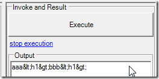
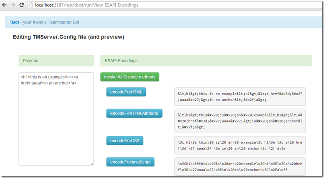

##  First execution of ESAPI.jar Encoder methods from O2's C# REPL 

Last month (when I was preparing to do the [OWASP AppSensor and O2 Platform at Security B-Sides London](http://blog.diniscruz.com/2013/04/owasp-appsensor-and-o2-platform-at.html) workshop with colin), I achieved something that I have been trying to do for a while:

**Use the [O2 Platform](http://blog.diniscruz.com/p/owasp-o2-platform.html)'s [C# REPL](http://blog.diniscruz.com/p/c-repl-script-environment.html) environment to programatically access (in real time) the [ESAPI jar ](https://www.owasp.org/index.php/Category:OWASP_Enterprise_Security_API)apis and methods. **(see prob described at the end of [Loading OWASP ESAPI jar and its dependencies from C# (using jni4net)](http://blog.diniscruz.com/2013/03/loading-owasp-esapi-jar-and-its.html) for my last attempt)

And I'm happy to say that '**_consuming the ESAPI jar from .Net_**', is exactly what I was able to achieve last month :)

I was also able to consume **_AppSensor's jar_** directly from a .NET app (in that case TeamMentor) and I have a lot more blog posts to write up on that topic.

This current post,  is the one I wrote at the time of the breakthrough (last month), which got stuck in the drafts folder and remained unpublished (until now)

--------------

When I was integrating AppSensor (java) with TeamMentor (.NET) I needed to solve the the problem described in [Loading OWASP ESAPI jar and its dependencies from C# (using jni4net)](http://blog.diniscruz.com/2013/03/loading-owasp-esapi-jar-and-its.html)  since AppSensor has an hard dependency on ESAPI (i.e. without ESAPI, AppSensor doesn't work)

After a bit of research and coding, here is the first code sample that shows ESAPI being consumed from O2 (via Jni4Net)

Note how the ESAPI Encoder's **_encodeForHTML_** method is being executed:

And displayed in the Output window:

To to clarify, although this code is being triggered and executed from a .Net GUI and CLR, the actual code that is doing the encoding is the one from [http://owasp-esapi-java.googlecode.com/svn/trunk_doc/latest/org/owasp/esapi/Encoder.html](http://owasp-esapi-java.googlecode.com/svn/trunk_doc/latest/org/owasp/esapi/Encoder.html) which is running running on a JVM inside the same process as the CLR (the magic sauce is provided by the amazing [Jni4Net](http://blog.diniscruz.com/search/label/Jni4Net))

For example here is the execution result of the ESAPI Encoder's **_encodeForJavascript_**:

Which is exactly what I wanted :)

Btw, I wonder if we can also easily trigger the current ESAPI unit test the same way? :)

And now that we have the capability to see what the encodings output of the Java version of ESAPI look like, we can try to compare it with the ESAPI .NET methods (since they should match right?)

**Note 1:** The code sample shown in this post is here: [https://gist.github.com/DinisCruz/5451167](https://gist.github.com/DinisCruz/5451167)

**Note 2: **The current folder set-up and jars looks like this:

I think it works now ([vs before](http://blog.diniscruz.com/2013/03/loading-owasp-esapi-jar-and-its.html)) because the ESAPI.properties file is in the same path as the ESAPI.jar 
