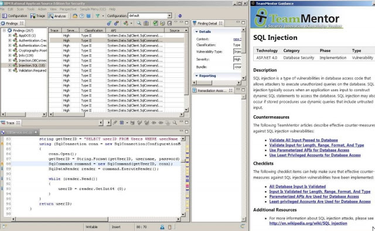

##  Using Jni4Net (Part 4) - Integrating AppScan with TeamMentor (first PoC) 

Using the [Jni4Net](http://jni4net.sourceforge.net/) based  Eclipse plugin shown in the [Using Jni4Net (Part 3) - Writing and Invoking O2 Methods from Java and Eclipse](http://diniscruz.blogspot.co.uk/2012/11/using-jni4net-part-3-writing-and.html) post, I was able to create a PoC of showing TeamMentor Guidance when a particular security finding is selected (in AppScan Source):

For more details on how this PoC was created, take a [look at this pdf](https://dl.dropbox.com/u/81532342/O2%20Raw%20Docs/Pdfs/Integrating%20AppScan%20with%20TeamMentor%20%28PoC%201%29.pdf):