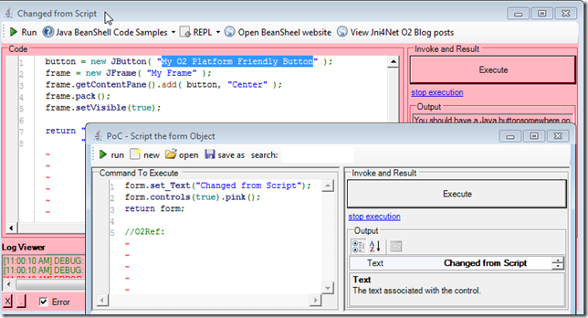

##  Util - Jni4Net - Java BeanShell REPL v1.0.exe 

Using the technique shown in the [Invoking Java BeanShell from .Net CLR](http://blog.diniscruz.com/2013/03/invoking-java-beanshell-from-net-clr.html)  post, here is REPL that allows the quick execution of Java BeanShell command in a C# GUI

You can download this stand-alone O2 tool from: [Util - Jni4Net - Java BeanShell REPL v1.0.exe](https://o2platform.googlecode.com/files/Util%20-%20Jni4Net%20-%20Java%20%20BeanShell%20REPL%20v1.0.exe)

And this is what the default GUI looks like:

If you expand the Console Out panel, you can see the Jni4Net initialization messages:

There are a number of code samples included:

Which will be auto executed on selection:

This one for example:

will create a Java button:

which of course can be modified and executed:

Also included is a REPL menu

That allows the scripting of the current Form:

like for example: **changing its title and making all controls pink**

or **inject a WebBrowser (on the left) with the Jni4Net website:**

The other REPL menu item:

Allows the scripting and visualization of the Jni4Net object:

For reference here is the script (also available at **_O2.Platform.Scripts\3rdParty\Jni4Net\Util - Jni4Net - Java  BeanShell REPL.h2_**) that created this GUI (a bit messy and in need for a good dose of refactoring)):  

    
    O2Setup.extractEmbededConfigZips();

    //Set value of Bridge.homeDir  
    var jni4NetDir = PublicDI.config.ToolsOrApis.pathCombine(@"Jni4Net\lib");  
    var fieldInfo = (FieldInfo)typeof(Bridge).field("homeDir");  
    PublicDI.reflection.setField(fieldInfo, jni4NetDir);  
    //return typeof(Bridge).fieldValue("homeDir");
    
    "jni4net.j-0.8.6.0.jar location: {0}".info(Bridge.FindJar());
    
    //stand-alone tool not working (not finding the "jni4net.j-0.8.6.0.jar");
    
    //"jni4net.n-0.8.6.0.dll is at: {0}".info("jni4net.n-0.8.6.0.dll".assembly_Location());  
    var topPanel = "Util - JavaBean REPL - {0}".format(clr.details()).popupWindow(800,400)   
                                                                     .insert_LogViewer();   
    //var topPanel = panel.clear().add_Panel(); 

    Action execute =null;

    var replGui = topPanel.add_REPL_Gui();   
    replGui.On_ExecuteCode = ()=> execute();

    replGui.Output_Panel.insert_Below("Console Out").add_ConsoleOut();

    "test console out".console_WriteLine();

    var codeText = replGui.Code_Panel.add_SourceCodeViewer();  
    var toolStrip = topPanel.insert_Above_ToolStrip()  
                            .add_Button("Run", "btExecuteSelectedMethod_Image".formImage(),()=> execute())  
                            .toolStrip();  
    var samplesMenu = toolStrip.add_DropDown("Java BeanShell Code Samples", "help_browser".formImage());   
    var beanShellJar = "http://www.beanshell.org/bsh-2.0b4.jar".uri().download(false);   
    //configure Jni4Net bridge and BeanShell  
    "Configuring Jnu4Net".info();  
    var jni4Net = new API_Jni4Net();  
    jni4Net.setUpBride();  
    "Default Jni4Net bridge setup ".info();

    var interpreterClass = beanShellJar.java_Jar_Class("bsh.Interpreter");  
    if(interpreterClass.isNull() && clr.x86()) // most likely means it couldn't find a compatible   
    {  
        var javaHomeLocation = @"C:\Program Files (x86)\Java\jre7";  
        "interpretreClass was null, and this is a 32bit process, so to set-up bridge with JavaHome: {0}".error(javaHomeLocation);  
        var bridgeSetup = new BridgeSetup() { JavaHome = javaHomeLocation};  
        jni4Net.setUpBride(bridgeSetup);  
        interpreterClass = beanShellJar.java_Jar_Class("bsh.Interpreter");  
    }  
    var interpreter = interpreterClass.ctor();
    
    if (interpreter.isNull())  
    {  
        "Failed to create interpreter instance".error();  
    }

    java.lang.System.@out.println("Hello Java world!");
    
    //set execute method  
    execute =   
    ()=>{   
            var code = codeText.get_Text().java_String();  
            try  
            {  
                var result = interpreter.java_Invoke_UsingSignature("eval","(Ljava/lang/String;)Ljava/lang/Object;",code);   
                replGui.showOutput(result.str());   
            }  
            catch(System.Exception ex)  
            {  
                ex.log("Execution error");  
                replGui.showErrorMessage(ex.Message);  
            }   
        };   
        Action<string,string> addCodeSample =   
            (title, codeSample)=> samplesMenu.add_Button(title,   
                                                   ()=>{  
                                                            codeText.set_Text(codeSample);  
                                                            execute();  
                                                       });  
        Func<string> getJni4NetReplCode =  
            ()=>{  
                    return "return jni4Net.bridgeSetup;".line().line() +   
                           "//O2Ref:jni4net.n-0.8.6.0.dll".line() +   
                           "//O2Ref:{0}".format(jni4Net.type().Assembly.ManifestModule.str());  
                 };

  
    toolStrip.add_DropDown("REPL", "text_x_script".formImage())  
             .add_Button("REPL Form" , ()=>topPanel.parentForm().script_Me("form"))  
             .add_Button("REPL Jni4Net" , ()=>jni4Net.script_Me("jni4Net").set_Code(getJni4NetReplCode()))  
             .add_Button("REPL Jni4Net Assembly" , ()=>jni4Net.type().Assembly.script_Me("assembly"));

    toolStrip.add_Button("Open BeanSheel website", "internet_web_browser".formImage(), 
                                ()=>"http://www.beanshell.org/".startProcess())  
             .add_Button("View Jni4Net O2 Blog posts", "internet_web_browser".formImage(),
                                ()=>"http://blog.diniscruz.com/search/label/Jni4Net".startProcess());

    //Code samples

    addCodeSample("Hello World", "return \"Hello World (from java bean)\";");  
    addCodeSample("Java Properties", "return java.lang.System.getProperties();");

    addCodeSample("Int sums",   
                 @"int a = 12;  
                   return a + 30;");

    addCodeSample("Hashtable and date",   
                 @"Hashtable hashtable = new Hashtable();  
                   Date date = new Date();  
                   hashtable.put( ""today"", date );  
                   return hashtable.get(""today"");");

  
    addCodeSample("Create java button",  
                 @"button = new JButton( ""My Button"" );  
                   frame = new JFrame( ""My Frame"" );  
                   frame.getContentPane().add( button, ""Center"" );  
                   frame.pack();  
                   frame.setVisible(true);
    
                   return ""You should have a Java button"" +   
                   ""somewhere on your screen"";");
    
      
    addCodeSample("System.out.println (not working)",  
                @"java.lang.System.out.println(""Hello Java world!"");  
                  return ""done"";");

    samplesMenu.items().first()  
                .PerformClick();
    
    replGui.Execute_Button.click();  
    replGui.Output_Panel.splitterDistance(50);
    
    return "done";
    
          
    //using System.Reflection  
    //using net.sf.jni4net  
    //using net.sf.jni4net.jni;  
    //using java.lang;  
    //using java.net;  
    //O2File:API_Jni4Net.cs  
    //O2Ref:Jni4Net\lib\jni4net.n-0.8.6.0.dll  
    //O2Embed:java.ico  
    //O2EmbedTool:Jni4Net  